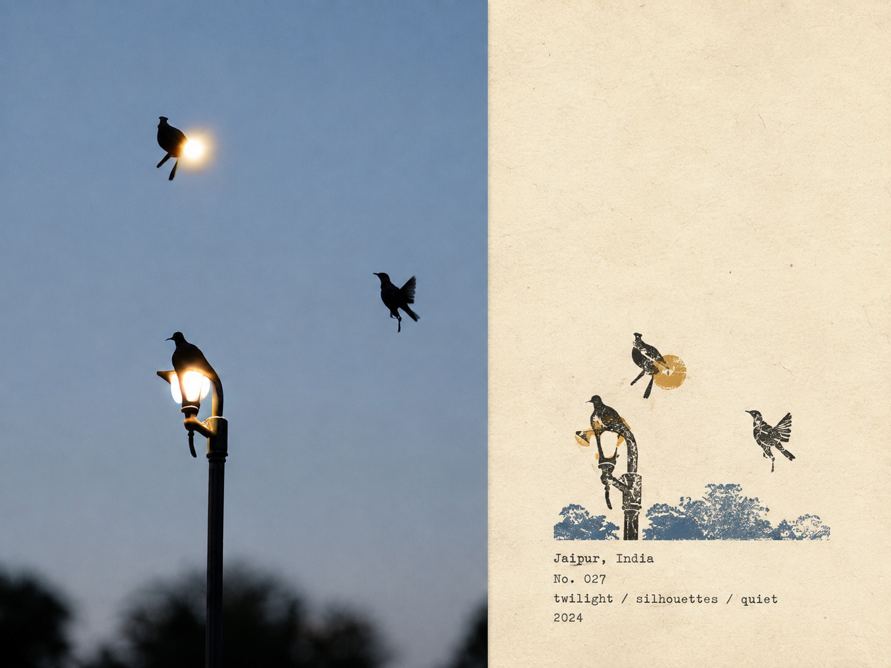

我平常用 Claude 比較多，但 Claude 網頁版沒有內建像 DALL-E 那樣的生圖擴散模型，圖片風格轉換這件事一直是在 ChatGPT 那邊解決的。這篇要記的不是「怎麼把圖片轉風格」本身，而是我最近才發現的一個更好用的做法：把一段很長、每次都要重貼的提示詞，包成一個自訂 GPT，之後只要上傳圖片就會自動套用，不用再複製貼上。

---

### 起因：一個韓文自訂 GPT，讓我發現自己一直在做重複的事

會注意到這個做法，是因為有人在 Threads 上分享了一個韓文的自訂 GPT，上傳照片就會吐出固定風格的圖。點進去玩了一下才意識到：這不是對話裡臨時貼提示詞生出來的結果，而是對方把提示詞**寫進了 GPT 的設定裡**，變成一個可以重複使用的工具——別人只要上傳圖片，不需要知道、也不需要貼那一大串提示詞。

查了「探索 GPT」（Explore GPTs，ChatGPT 的自訂 GPT 商店）才搞懂，這是 ChatGPT 的 GPT Builder 功能：在 instructions 欄位把提示詞寫死，之後開這個 GPT 對話，效果就跟每次手動貼提示詞一樣，只是不用再貼了。

看懂機制的當下第一個念頭是：我手上已經收集了好幾組從 Threads 上抄下來的風格轉換提示詞，每次要用都是開新對話、貼一大段提示詞、再上傳圖片，那段提示詞几乎沒有變化，純粹是體力活——原來這件事根本不用重複做。就把手上的幾組提示詞分別包成了自己的自訂 GPT，效果跟直接在對話裡貼提示詞一模一樣，差別只在於：以後要用同一個風格，直接開對應的 GPT、丟圖，就結束了。

### 示範：橡皮圖章旅行筆記海報風格

挑一組效果最滿意的來展示。這個示範做起來意外地順，原因也很直接：提示詞是別人已經反覆調校過的成果，我要做的只是把它包進 GPT Builder 的 instructions 欄位、存檔——連測試調整的空間都不太需要。

原圖是我自己在印度 Jaipur 拍的黃昏鳥類剪影照，轉換後會變成一張帶手工刻章質感的「旅行筆記海報」，畫面右側保留大量留白，附上地點、編號、氛圍關鍵字跟年份：



完整提示詞如下（**非原創，是我從網路上收集整理的分享內容，不是自己寫的**，記不清最早是哪一則貼文了，就不特別附連結）：

```text
Please create a separate "Rubber Stamp Travel Field Notes Poster" for each photo I upload, outputting each photo individually without collage or multi-image combinations.

Overall, use a 4:3 landscape composition, dividing the frame into left and right regions, but without drawing an obvious dividing line.

The left side takes up about 58% of the frame, faithfully preserving the original photo. Accurately maintain the main subject identity, terrain, architecture, plants, people, spatial relationships, natural lighting and shadows, authentic textures, and the original color atmosphere; apply only restrained art publication-level photo color grading, and add extremely subtle, fine-grained film noise. For layout adaptation, natural cropping is allowed, but do not stretch, distort, shift, replace, or redraw the main subject.

The right side takes up about 42% of the frame, using a warm off-white aged paper as the background. The paper features subtle fibers, natural grain, light usage marks, and a matte texture, while preserving large areas of unprinted paper whitespace, making the blank space an essential part of the layout.

Analyze the original photo and extract the most location-distinctive subject outlines, architectural structures, terrain contours, plant forms, roads, shorelines, or other key visual relationships, compressing them into a small multi-color rubber stamp image.

Do not replicate every single element from the photo item by item. Retain only the minimal information necessary to instantly recognize the original location, subject, and scene relationships. Remove crowds, vehicles, dense windows, repetitive buildings, fragmented vegetation, decorative elements, and irrelevant backgrounds.

The stamp is positioned in the lower-middle of the right-side paper area, occupying only about 30%–38% of the right region's height, with ample whitespace preserved around it. The stamp must not be enlarged into a standard illustration, full landscape painting, or brand logo.

Determine the stamp's organization based on the original photo's composition:

- Iconic architecture: Retain the most distinctive outer contours, roofs, domes, arches, towers, or main structures.
- Mountain settlements: Compress buildings into a few terraced color blocks aligned along the terrain.
- Coastal scenery: Retain mountain contours, settlement layers, shorelines, and sparse intermittent water ripples.
- City panoramas: Retain the main skyline, one iconic building, and one or two layers of distant mountains.
- Natural landscapes: Retain primary mountain forms, trees, shorelines, or road orientations.
- Foreground occlusions: If narratively important in the original photo, retain as foreground stamp outlines.

Extract 2–4 spot inks from the original photo. Prioritize desaturated colors like carbon black, deep green, brick red, ochre yellow, slate blue, or taupe brown, but do not force a fixed palette. Preserve the most distinctive color character from the original photo, allowing only a small area of color for visual emphasis.

Render each color as a separately hand-stamped effect:

Authentic rubber stamp carving texture, hand-engraved marks, uneven line widths, contour notches, fractured edges, dry ink shortages, paper show-through, granular ink, uneven pressure, partial ghosting, and about 1–2 mm of subtle misregistration.

Allow natural misalignment between color layers; edges must not be digitally smoothed. The print should resemble a real carved stamp pressed onto aged paper, not a filtered photo, smooth vector illustration, or line-art logo.

Generate text based on the photo's location, theme, and visual imagery:

Location English name
No. Number
Three short English keywords
Gregorian calendar year

Place the text below or adjacent to the stamp in the whitespace, using a small, restrained, slightly mechanically imperfect typewriter font. The typography should evoke a traveler's field record, not an ad headline. Ensure all text is spelled accurately, without adding irrelevant slogans, brands, or decorative copy.

The overall vibe is like field notes kept by an architect, travel writer, or natural observer: quiet, restrained, tactilely real, regionally specific, with handmade imperfections and a collectible feel. The photo handles the on-site record; the stamp captures the most recognizable fragments of memory.

Avoid: Obvious central dividing lines, circular seals, Chinese red stamps, postage stamp perforations, wax seals, sticker collages, tourist souvenir templates, smooth vector logos, generic city icons, full replication of all architecture, dense detailing, childlike craftiness, cartoon style, 3D rendering, plastic textures, glossy digital gradients, oversaturation, excessive text, decorative clutter, and redrawing or altering the left-side original photo.
```

把這段貼進 GPT Builder 的 instructions 欄位、存成一個自訂 GPT 之後，之後每次要用這個風格，開這個 GPT、丟圖就好，不用再回頭找這段提示詞存在哪裡。

### 小結

這篇真正想記的不是「橡皮圖章旅行筆記海報」這個風格多好看，而是「把重複要貼的提示詞包成自訂 GPT」這件事本身——任何你會重複用同一段長提示詞的場景，不限於圖片風格轉換，都可以用同樣的做法省掉每次重貼的動作。這組風格轉換提示詞只是我手上剛好有素材、效果也還不錯的一個示範案例。
